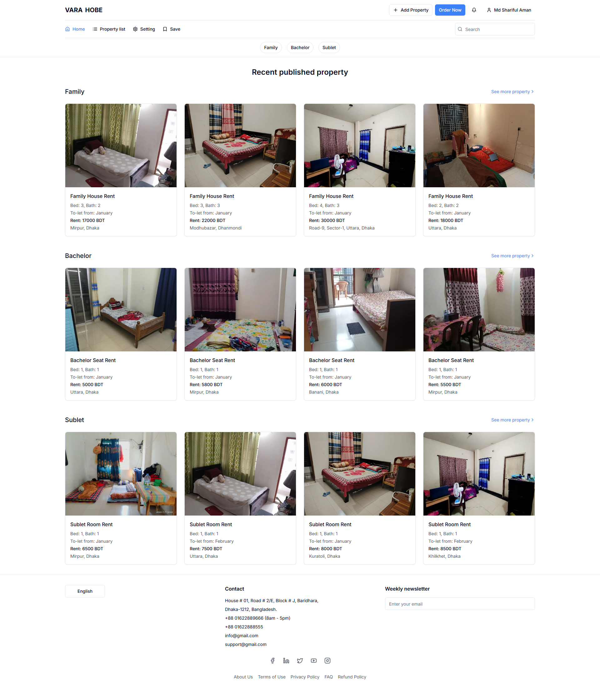
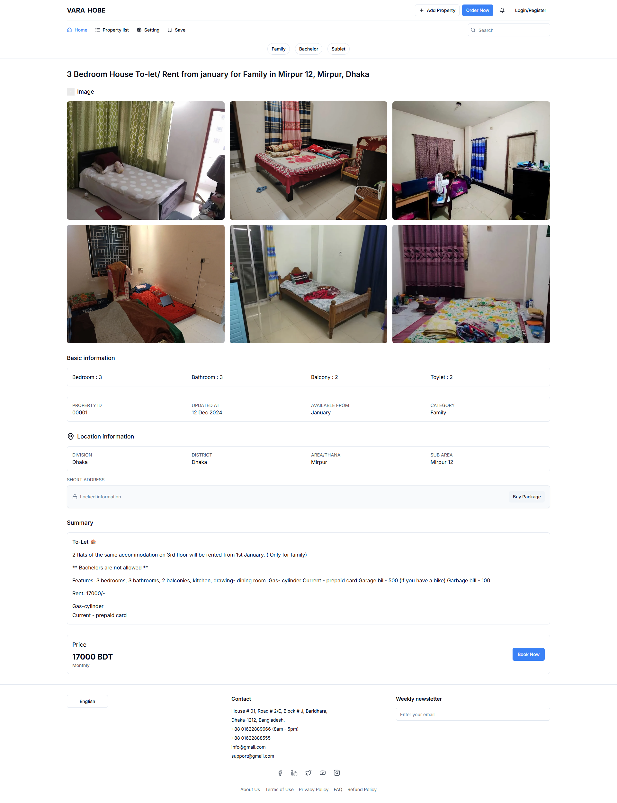

<h1 align="center">Vara Hobe 🏡</h1>

  A full-featured house rental listing platform built for urban users in Bangladesh.

  
  
  
  

---

## 🧾 About the Project

**Vara Hobe** is a web-based rental management platform that allows users to:
- Find homes by category: **Family**, **Bachelor**, or **Sublet**
- View detailed property listings
- Register/Login to book or post listings
- Save listings and browse filtered results
- Contact owners and manage property information

---

## 📷 Screenshots

### 🔐 Registration Page

### 🏡 Home Page - Recent Listings

### 📝 Property Details Page

---

## 🚀 Features

- 🔒 **Authentication**: Secure registration & login system
- 📋 **Property Management**: Add and update rental listings
- 🧭 **Filtered Browsing**: Family, Bachelor, and Sublet view filters
- 🛒 **Booking System**: Direct booking from property details
- 💬 **Contact Section**: Easily get in touch with the provider
- 📱 **Responsive Design**: Mobile and desktop friendly

---

## 🔧 Tech Stack

- **Frontend**: Next.js, Tailwind CSS
- **Backend**: Nest.js
- **Authentication**: Email & Password based registration
- **Deployment**: (To be added if deployed)

---
